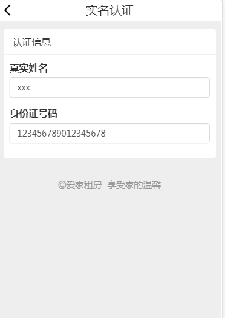

### 开发接口

#### 1. 用户模块接口
  - [注册](docs/user/user_register.md)
  - [登录](docs/user/user_login.md)
  - [个人中心]
	  - [获取用户信息](docs/user/user_get_msg.md)
	  - [修改用户信息](docs/user/user_put_msg.md)
	  - [实名认证](docs/user/user_auth.md)
	  - [注销](docs/user/user_logout.md)
	  - [我的房源--实名认证/房屋信息展示](docs/house/auth_myhouse.md)
	  

#### 2. 房屋模块接口

  - [首页](docs/house/index.md)
  - [首页搜索](docs/house/search.md)
  - [获取区域和设施信息](docs/house/area_facility.md)
  - [房屋详情](docs/house/detail.md)

#### 3. 预约模块接口

  - [预约页面](docs/order/order.md)
  - [创建预约](docs/order/create_order.md)
  - [所有预约单](docs/order/allorders.md)
  - [房东预约单](docs/order/lorders.md)
  - [修改预约单状态](docs/order/changeorder.md)

***

### 功能点讲解

#### 用户模块

1. 登录注册退出

	a) 注册, 手机号、密码、确认密码、图片验证码

		a1）图片验证码，使用session + redis
		a2) 加密解密
			generate_password_hash
			check_password_hash
	b）登录，手机号、密码

		登录成功向session中存user_id
	c）退出

		清空session中的保存的用户id值

2. 个人中心信息展示

	a) 获取用户的姓名、头像、电话号

		

3.修改头像

	a) 上传选择的头像，使用ajaxSubmit
		阻止默认事件： e.preventDetault()

		$(this).ajaxSubmit(){
			url:'',
			dataType:'json',
			type:'POST/PATCH/PUT/DELETE/GET',
			success:function(data){},
			error:function(data){}
		}

4.修改用户名

5.用户登录状态的校验

	验证session中是否存在user_id

	def is_login(func):
    @wraps(func)
    def check_status(*args, **kwargs):
        try:
            user_id = session['user_id']
        except:
            return redirect(url_for('user.login'))
        return func(*args, **kwargs)
    return check_status

6.实名认证功能

	a) 提交用户名和身份证号码
		校验身份证号码，使用正则表达式
	十八位： ^[1-9]\d{5}(18|19|([23]\d))\d{2}((0[1-9])|(10|11|12))(([0-2][1-9])|10|20|30|31)\d{3}[0-9Xx]$

	十五位： ^[1-9]\d{5}\d{2}((0[1-9])|(10|11|12))(([0-2][1-9])|10|20|30|31)\d{2}$
	
	b) 实名认证只能认证一次，认证后页面中的提交按钮需要隐藏

部分功能图片：

#### 房屋模块

1. 我的房源列表功能(myhouse.html)

	判断用户是否进行实名认证。

		如果没有实名认证，则展示实名认证的框并隐藏发布房源和展示已发布房源的框。
		如果用户实名认证了，则展示用户发布房源的信息并隐藏实名认证的框

2. 发布房源功能(newhouse.html)

		1）刷新城区信息和设施信息
		2）发布新房源，保存房屋的基本信息
		3）发布房源的图片信息，设置房源的首图 

3. 房源详情功能（detail.html）

		获取房源信息，ajax异步加载页面

4. 即刻预约房源（booking.html）
	
		1) 预约房屋信息刷新
		2） 创建订单

5. 首页
		
		1) 获取当前登录用户信息
		2) 获取最近发布的前三个有首图的房屋，用于首页的房屋轮播图展示
		3）选择房源区域信息刷新

6. 搜索页面

		1）判断当前搜索的区域、入住时间和离店时间，通过条件查询已经在入住的房屋，搜索的房屋不需要展示当前已经入住的房屋信息。
		2）排序，按照入住时间最新，价格升序降序等排序

部分功能图片：

#### 订单模块

1. 创建订单

		获取下单的房屋的id、开始时间和结束时间，用于创建订单。
	
2. 我的订单
	
		获取当前登录系统用户下的订单。即为我的订单

3. 客户订单

		获取当前用户发布的房屋，通过该房屋去查询订单。即为客户下单的订单信息

部分功能图片：

